Q2. Flights at ABIA

```r
# Reading CSV File
ABIA = read.csv("D:/Summer Semester/Intro to Predictive Modelling/Unsupervised/data/ABIA.csv")
dim(ABIA)
```

```
## [1] 99260    29
```


```r
library(funModeling)
```

```
## Loading required package: Hmisc
```

```
## Loading required package: lattice
```

```
## Loading required package: survival
```

```
## Loading required package: Formula
```

```
## Loading required package: ggplot2
```

```
## 
## Attaching package: 'Hmisc'
```

```
## The following objects are masked from 'package:base':
## 
##     format.pval, units
```

```
## funModeling v.1.8 :)
## Examples and tutorials at livebook.datascienceheroes.com
```

```r
library(DataExplorer)
library(dplyr)
```

```
## 
## Attaching package: 'dplyr'
```

```
## The following objects are masked from 'package:Hmisc':
## 
##     src, summarize
```

```
## The following objects are masked from 'package:stats':
## 
##     filter, lag
```

```
## The following objects are masked from 'package:base':
## 
##     intersect, setdiff, setequal, union
```

```r
library(magrittr)
library(ggplot2)
```


```r
ABIA$Month = as.factor(ABIA$Month)
ABIA$DayOfWeek = as.factor(ABIA$DayOfWeek)
```


```r
summary(ABIA)
```

```
##       Year          Month         DayofMonth    DayOfWeek    DepTime    
##  Min.   :2008   6      : 9090   Min.   : 1.00   1:14798   Min.   :   1  
##  1st Qu.:2008   5      : 9021   1st Qu.: 8.00   2:14803   1st Qu.: 917  
##  Median :2008   7      : 8931   Median :16.00   3:14841   Median :1329  
##  Mean   :2008   3      : 8921   Mean   :15.73   4:14774   Mean   :1329  
##  3rd Qu.:2008   1      : 8726   3rd Qu.:23.00   5:14768   3rd Qu.:1728  
##  Max.   :2008   8      : 8553   Max.   :31.00   6:11454   Max.   :2400  
##                 (Other):46018                   7:13822   NA's   :1413  
##    CRSDepTime      ArrTime       CRSArrTime   UniqueCarrier  
##  Min.   :  55   Min.   :   1   Min.   :   5   WN     :34876  
##  1st Qu.: 915   1st Qu.:1107   1st Qu.:1115   AA     :19995  
##  Median :1320   Median :1531   Median :1535   CO     : 9230  
##  Mean   :1320   Mean   :1487   Mean   :1505   YV     : 4994  
##  3rd Qu.:1720   3rd Qu.:1903   3rd Qu.:1902   B6     : 4798  
##  Max.   :2346   Max.   :2400   Max.   :2400   XE     : 4618  
##                 NA's   :1567                  (Other):20749  
##    FlightNum       TailNum      ActualElapsedTime CRSElapsedTime 
##  Min.   :   1          : 1104   Min.   : 22.0     Min.   : 17.0  
##  1st Qu.: 640   N678CA :  195   1st Qu.: 57.0     1st Qu.: 58.0  
##  Median :1465   N511SW :  180   Median :125.0     Median :130.0  
##  Mean   :1917   N526SW :  176   Mean   :120.2     Mean   :122.1  
##  3rd Qu.:2653   N528SW :  172   3rd Qu.:164.0     3rd Qu.:165.0  
##  Max.   :9741   N520SW :  168   Max.   :506.0     Max.   :320.0  
##                 (Other):97265   NA's   :1601      NA's   :11     
##     AirTime          ArrDelay           DepDelay           Origin     
##  Min.   :  3.00   Min.   :-129.000   Min.   :-42.000   AUS    :49623  
##  1st Qu.: 38.00   1st Qu.:  -9.000   1st Qu.: -4.000   DAL    : 5583  
##  Median :105.00   Median :  -2.000   Median :  0.000   DFW    : 5508  
##  Mean   : 99.81   Mean   :   7.065   Mean   :  9.171   IAH    : 3704  
##  3rd Qu.:142.00   3rd Qu.:  10.000   3rd Qu.:  8.000   PHX    : 2786  
##  Max.   :402.00   Max.   : 948.000   Max.   :875.000   DEN    : 2719  
##  NA's   :1601     NA's   :1601       NA's   :1413      (Other):29337  
##       Dest          Distance        TaxiIn           TaxiOut      
##  AUS    :49637   Min.   :  66   Min.   :  0.000   Min.   :  1.00  
##  DAL    : 5573   1st Qu.: 190   1st Qu.:  4.000   1st Qu.:  9.00  
##  DFW    : 5506   Median : 775   Median :  5.000   Median : 12.00  
##  IAH    : 3691   Mean   : 705   Mean   :  6.413   Mean   : 13.96  
##  PHX    : 2783   3rd Qu.:1085   3rd Qu.:  7.000   3rd Qu.: 16.00  
##  DEN    : 2673   Max.   :1770   Max.   :143.000   Max.   :305.00  
##  (Other):29397                  NA's   :1567      NA's   :1419    
##    Cancelled       CancellationCode    Diverted         CarrierDelay   
##  Min.   :0.00000    :97840          Min.   :0.000000   Min.   :  0.00  
##  1st Qu.:0.00000   A:  719          1st Qu.:0.000000   1st Qu.:  0.00  
##  Median :0.00000   B:  605          Median :0.000000   Median :  0.00  
##  Mean   :0.01431   C:   96          Mean   :0.001824   Mean   : 15.39  
##  3rd Qu.:0.00000                    3rd Qu.:0.000000   3rd Qu.: 16.00  
##  Max.   :1.00000                    Max.   :1.000000   Max.   :875.00  
##                                                        NA's   :79513   
##   WeatherDelay       NASDelay      SecurityDelay    LateAircraftDelay
##  Min.   :  0.00   Min.   :  0.00   Min.   :  0.00   Min.   :  0.00   
##  1st Qu.:  0.00   1st Qu.:  0.00   1st Qu.:  0.00   1st Qu.:  0.00   
##  Median :  0.00   Median :  2.00   Median :  0.00   Median :  6.00   
##  Mean   :  2.24   Mean   : 12.47   Mean   :  0.07   Mean   : 22.97   
##  3rd Qu.:  0.00   3rd Qu.: 16.00   3rd Qu.:  0.00   3rd Qu.: 30.00   
##  Max.   :412.00   Max.   :367.00   Max.   :199.00   Max.   :458.00   
##  NA's   :79513    NA's   :79513    NA's   :79513    NA's   :79513
```


```r
# Summary of numerical variables
profiling_num(ABIA)
```

```
##             variable    mean std_dev variation_coef p_01 p_05 p_25 p_50
## 1               Year 2.0e+03 0.0e+00           0.00 2008 2008 2008 2008
## 2         DayofMonth 1.6e+01 8.8e+00           0.56    1    2    8   16
## 3            DepTime 1.3e+03 4.6e+02           0.35  550  638  917 1329
## 4         CRSDepTime 1.3e+03 4.5e+02           0.34  600  640  915 1320
## 5            ArrTime 1.5e+03 5.0e+02           0.33   35  743 1107 1531
## 6         CRSArrTime 1.5e+03 4.7e+02           0.31  633  805 1115 1535
## 7          FlightNum 1.9e+03 1.7e+03           0.87   73  219  640 1465
## 8  ActualElapsedTime 1.2e+02 6.1e+01           0.51   40   45   57  125
## 9     CRSElapsedTime 1.2e+02 6.2e+01           0.50   45   50   58  130
## 10           AirTime 1.0e+02 5.8e+01           0.59   27   30   38  105
## 11          ArrDelay 7.1e+00 3.4e+01           4.77  -28  -19   -9   -2
## 12          DepDelay 9.2e+00 3.1e+01           3.40  -10   -8   -4    0
## 13          Distance 7.1e+02 4.7e+02           0.67  140  140  190  775
## 14            TaxiIn 6.4e+00 4.8e+00           0.76    2    3    4    5
## 15           TaxiOut 1.4e+01 9.2e+00           0.66    6    7    9   12
## 16         Cancelled 1.4e-02 1.2e-01           8.30    0    0    0    0
## 17          Diverted 1.8e-03 4.3e-02          23.40    0    0    0    0
## 18      CarrierDelay 1.5e+01 3.5e+01           2.29    0    0    0    0
## 19      WeatherDelay 2.2e+00 1.5e+01           6.83    0    0    0    0
## 20          NASDelay 1.2e+01 2.5e+01           2.04    0    0    0    2
## 21     SecurityDelay 7.1e-02 2.0e+00          28.29    0    0    0    0
## 22 LateAircraftDelay 2.3e+01 3.9e+01           1.72    0    0    0    6
##    p_75 p_95 p_99 skewness kurtosis  iqr     range_98     range_80
## 1  2008 2008 2008      NaN      NaN    0 [2008, 2008] [2008, 2008]
## 2    23   29   31    0.007      1.8   15      [1, 31]      [4, 28]
## 3  1728 2047 2235    0.055      1.9  811  [550, 2235]  [714, 1945]
## 4  1720 2030 2156    0.073      1.8  805  [600, 2156]  [715, 1930]
## 5  1903 2232 2341   -0.334      2.7  796   [35, 2341]  [843, 2130]
## 6  1902 2230 2344   -0.181      2.3  787  [633, 2344]  [855, 2130]
## 7  2653 5748 7271    1.415      4.5 2013   [73, 7271]  [318, 4221]
## 8   164  227  266    0.406      2.3  107    [40, 266]    [48, 203]
## 9   165  230  265    0.361      2.1  107    [45, 265]    [50, 205]
## 10  142  202  229    0.336      2.0  104    [27, 229]    [32, 181]
## 11   10   65  156    4.433     37.5   19   [-28, 156]    [-15, 35]
## 12    8   62  153    5.107     44.6   12   [-10, 153]     [-6, 33]
## 13 1085 1504 1698    0.222      1.8  895  [140, 1698]  [148, 1342]
## 14    7   14   26    4.786     51.7    3      [2, 26]      [3, 11]
## 15   16   28   50    5.767     72.5    7      [6, 50]      [8, 22]
## 16    0    0    1    8.180     67.9    0       [0, 1]       [0, 0]
## 17    0    0    0   23.354    546.4    0       [0, 0]       [0, 0]
## 18   16   76  174    5.367     52.9   16  [0, 173.54]      [0, 44]
## 19    0    5   65   12.011    199.2    0   [0, 64.54]       [0, 0]
## 20   16   51  128    4.896     38.7   16     [0, 128]      [0, 32]
## 21    0    0    0   64.315   5474.4    0       [0, 0]       [0, 0]
## 22   30   98  186    3.261     18.2   30     [0, 186]      [0, 66]
```


```r
# Plot for amount of cancellations per month
monthlycancellation = ABIA %>%
  group_by(Month)  %>%
  summarise(cancel.sum = sum(Cancelled))

ggplot(monthlycancellation, aes(x=Month, y=cancel.sum)) + 
  geom_bar(stat='identity') + 
  labs(title="Number of cancellations each month",
       y="Number of cancellations",
       x = "Month") + 
  coord_flip()
```

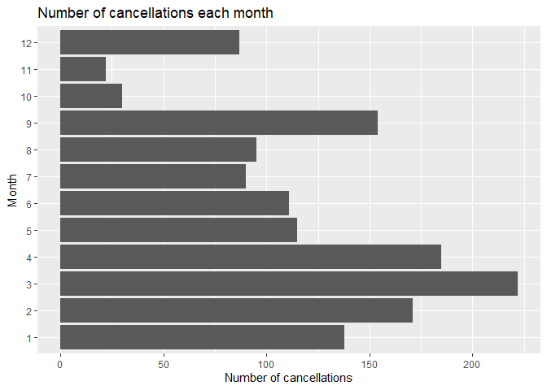<!-- -->

#Most of the flights that are getting cancelled are the ones in March.


```r
# Plot for amount of cancellations per carrier
monthlycancellation = ABIA %>%
  group_by(UniqueCarrier)  %>%
  summarise(cancel.sum = sum(Cancelled))

ggplot(monthlycancellation, aes(x=reorder(UniqueCarrier, cancel.sum), y=cancel.sum)) + 
  geom_bar(stat='identity') +
  labs(title="Number of cancellations for each carrier",
       y="Number of cancellations",
       x = "Carrier") + 
  coord_flip()
```

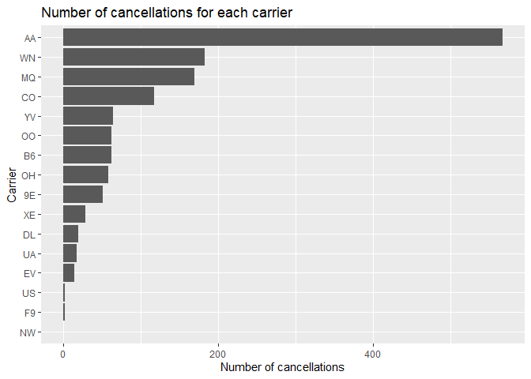<!-- -->

#Most of the flights that are getting cancelled belong to American Airlines.


```r
# Plot for amount of cancellations per origin
origincancellation = ABIA %>%
  group_by(Origin)  %>%
  summarise(cancel.sum = sum(Cancelled))

origincancellation = as.data.frame(origincancellation)
origincancellation <-origincancellation[which(origincancellation$cancel.sum > 10),]

ggplot(origincancellation, aes(x=reorder(Origin, cancel.sum), y=cancel.sum)) + 
  geom_bar(stat='identity') +
  labs(title="Number of cancellations for each origin",
       y="Number of cancellations",
       x = "Orgin") +
  coord_flip()
```

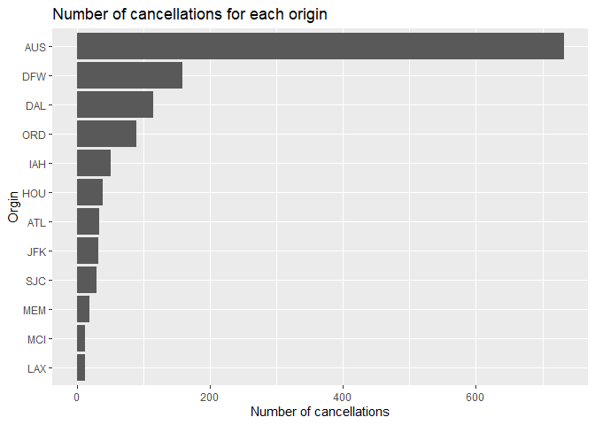<!-- -->


```r
# Plot for amount of cancellations per destination
destcancellation = ABIA %>%
  group_by(Dest)  %>%
  summarise(cancel.sum = sum(Cancelled))

destcancellation = as.data.frame(destcancellation)
destcancellation <-destcancellation[which(destcancellation$cancel.sum > 10),]

ggplot(destcancellation, aes(x=reorder(Dest, cancel.sum), y=cancel.sum)) + 
  geom_bar(stat='identity') + 
  labs(title="Number of cancellations for each destination",
       y="Number of cancellations",
       x = "Destination") +
  coord_flip()
```

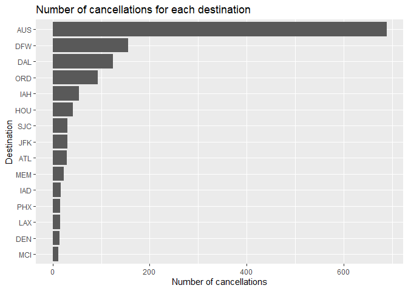<!-- -->

#The source and destination plots makes sense because most of the flights recorded in ABIA will either be from Austin or to Austin. Other than that, most of the passengers seem to be travelling to and from Dallas.


```r
# Plot for amount of cancellations for each day of the week
daycancellation = ABIA %>%
  group_by(DayOfWeek)  %>%
  summarise(cancel.sum = sum(Cancelled))

ggplot(daycancellation, aes(x=DayOfWeek, y=cancel.sum)) + 
  geom_bar(stat='identity') + 
  labs(title="Number of cancellations for each day of the week",
       y="Number of cancellations",
       x = "Day of the week") +
  coord_flip()
```

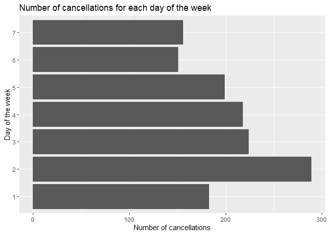<!-- -->
#Most of the cancellations happen on weekdays with the highest number of cancellations on Tuesday

#Now lets analyze the flights to and from Dallas

```r
DallasData <- ABIA[which(ABIA$Origin=='DFW' | ABIA$Dest=='DFW'),]
```


```r
# Plot for amount of cancellations to and from Dallas for each day of the week
daycancellation = DallasData %>%
  group_by(DayOfWeek)  %>%
  summarise(cancel.sum = sum(Cancelled))

ggplot(daycancellation, aes(x=DayOfWeek, y=cancel.sum)) + 
  geom_bar(stat='identity') + 
  labs(title="Number of cancellations for each day of the week for Dallas flights",
       y="Number of cancellations",
       x = "Day of the week") +
  coord_flip()
```

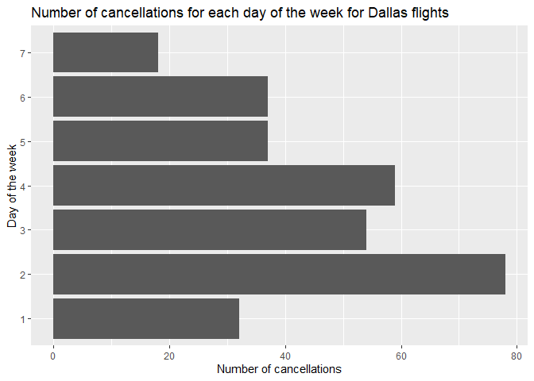<!-- -->

#Flights on tuesdays tend to get cancelled more often.


```r
# Plot for amount of cancellations as per distance to be covered by the flight
distcancellation = ABIA %>%
  group_by(Distance)  %>%
  summarise(cancel.sum = sum(Cancelled))

ggplot(distcancellation, aes(x=Distance, y=cancel.sum)) + 
  geom_point(stat='identity') + 
  labs(title="Number of cancellations vs distance covered by the flight",
       y="Number of cancellations",
       x = "Distance covered by the flight") +
  coord_flip()
```

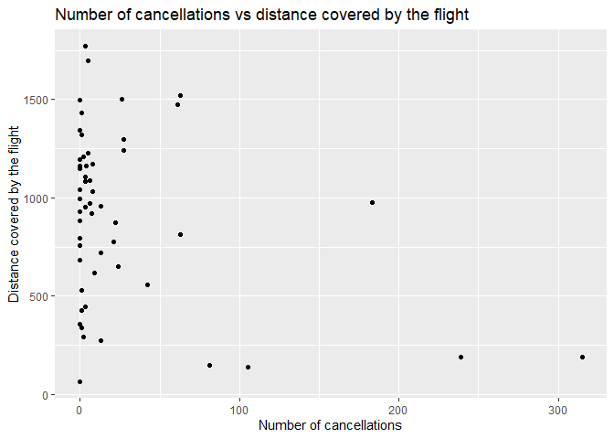<!-- -->

#Most of the flights that get cancelled are the ones that are supposed to cover shorter distances.


```r
# Plot for amount of cancellations per departure time
depcancellation = ABIA %>%
  group_by(CRSDepTime)  %>%
  summarise(cancel.sum = sum(Cancelled))

ggplot(depcancellation, aes(x=CRSDepTime, y=cancel.sum)) + 
  geom_point(stat='identity') + 
  labs(title="Number of cancellations vs departure time",
       y="Number of cancellations",
       x = "Departure Time") +
  coord_flip()
```

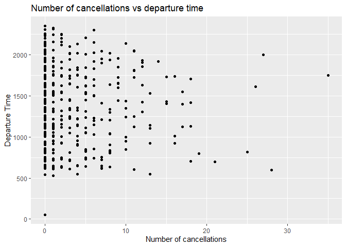<!-- -->
#Many flights got cancelled during early hours of the day


```r
# Plot for amount of cancellations per day of the year
daymonthcancellation = ABIA %>%
  group_by(Month, DayofMonth)  %>%
  summarise(cancel.sum = sum(Cancelled))

ggplot(daymonthcancellation, aes(x=DayofMonth, y=cancel.sum)) + 
  geom_bar(stat='identity') + 
  labs(title="Number of cancellations vs day of the month",
       y="Number of cancellations",
       x = "Day of the month") +
  #coord_flip()+
  facet_wrap(~ Month, nrow = 3)
```

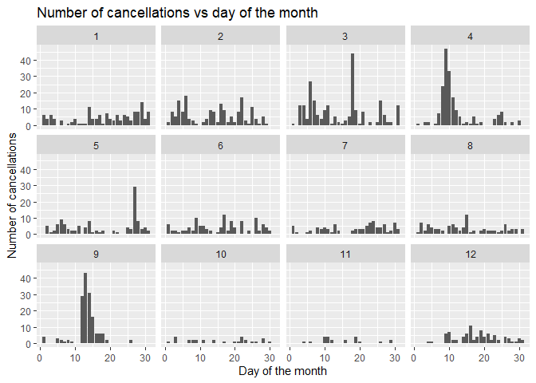<!-- -->

#Most of the flights that got cancelled were scheduled in March, April or September
#Most of the flights get cancelled in the middle of the month that is from 10th-20th

#Let's look at the arrival and departure delays for different carriers


```r
ggplot(ABIA, aes(x=(UniqueCarrier), ArrDelay)) + 
  geom_boxplot(fill="plum", outlier.shape = NA) + 
  scale_y_continuous(limits = quantile(ABIA$ArrDelay, c(0.1, 0.9),na.rm =  TRUE)) +
  labs(title="Box plot", 
       subtitle="Arrival Delay by Carrier",
       x="Carrier",
       y="Arrival Delay")
```

```
## Warning: Removed 20051 rows containing non-finite values (stat_boxplot).
```

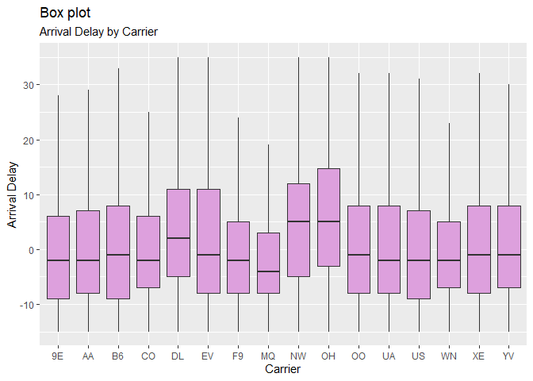<!-- -->
#Most of the carriers's flights arrive on average on or before the scheduled arrival time.


```r
ggplot(ABIA, aes(x=(UniqueCarrier), DepDelay)) + 
  geom_boxplot(fill="plum", outlier.shape = NA) + 
  scale_y_continuous(limits = quantile(ABIA$DepDelay, c(0.1, 0.9),na.rm =  TRUE)) +
  labs(title="Box plot", 
       subtitle="Departure Delay by Carrier",
       x="Carrier",
       y="Deaprture Delay")
```

```
## Warning: Removed 19746 rows containing non-finite values (stat_boxplot).
```

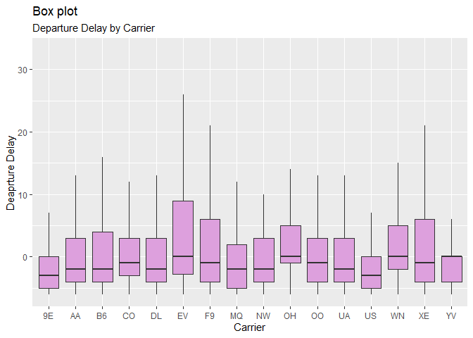<!-- -->
#Most of the carriers's flights depart on average on or before the scheduled departure time.

#OBSERVATIONS and RECOMMENDATIONS

#We can observe that most of the cancellations happened in February, March and April
#Flights of American Airlines and Southwest airlines get cancelled the most and the ones of Frontier and Northwest Airlines get cancelled the least
#We observe that the flights originating from Austin get cancelled the most which is obvious since the number of flights from Austin is more in the data
#Other origin airports from which flights get cancelled are DFW and DAL airport 
#Destination airports for which flights get cancelled are DFW and DAL airport
#If you are travelling from Dallas to Austin or Austin to Dallas you should expect a lot of cancellations
#Most of the cancellations seem to happen on weekdays with the most number of cancellations happening on Tuesday which can be due to the fact 
#It might be because people don't prefer to travel on weekdays due to their work commitments and low occupancy might be a reason of higher cancellations on weekdays
#Many flights got cancelled during early hours of the day which again might be because of low occupancy on early morning flights
#Most of the flights that got cancelled were scheduled in March, April or September
#This might be due to bad weather conditions and due to the hurricanes and tornadoes that severely affected Texas in 2008

