# *********************************************
# Visual story telling part 1: Green Buildings
# *********************************************


```r
# Loading required libraries

library(mosaic)
```

```
## Loading required package: dplyr
```

```
## 
## Attaching package: 'dplyr'
```

```
## The following objects are masked from 'package:stats':
## 
##     filter, lag
```

```
## The following objects are masked from 'package:base':
## 
##     intersect, setdiff, setequal, union
```

```
## Loading required package: lattice
```

```
## Loading required package: ggformula
```

```
## Loading required package: ggplot2
```

```
## Loading required package: ggstance
```

```
## 
## Attaching package: 'ggstance'
```

```
## The following objects are masked from 'package:ggplot2':
## 
##     geom_errorbarh, GeomErrorbarh
```

```
## 
## New to ggformula?  Try the tutorials: 
## 	learnr::run_tutorial("introduction", package = "ggformula")
## 	learnr::run_tutorial("refining", package = "ggformula")
```

```
## Loading required package: mosaicData
```

```
## Loading required package: Matrix
```

```
## Registered S3 method overwritten by 'mosaic':
##   method                           from   
##   fortify.SpatialPolygonsDataFrame ggplot2
```

```
## 
## The 'mosaic' package masks several functions from core packages in order to add 
## additional features.  The original behavior of these functions should not be affected by this.
## 
## Note: If you use the Matrix package, be sure to load it BEFORE loading mosaic.
```

```
## 
## Attaching package: 'mosaic'
```

```
## The following object is masked from 'package:Matrix':
## 
##     mean
```

```
## The following object is masked from 'package:ggplot2':
## 
##     stat
```

```
## The following objects are masked from 'package:dplyr':
## 
##     count, do, tally
```

```
## The following objects are masked from 'package:stats':
## 
##     binom.test, cor, cor.test, cov, fivenum, IQR, median,
##     prop.test, quantile, sd, t.test, var
```

```
## The following objects are masked from 'package:base':
## 
##     max, mean, min, prod, range, sample, sum
```

```r
library(tidyverse)
```

```
## -- Attaching packages ----------------------------------------------- tidyverse 1.2.1 --
```

```
## v tibble  2.1.3     v purrr   0.3.2
## v tidyr   0.8.3     v stringr 1.4.0
## v readr   1.3.1     v forcats 0.4.0
```

```
## -- Conflicts -------------------------------------------------- tidyverse_conflicts() --
## x mosaic::count()            masks dplyr::count()
## x purrr::cross()             masks mosaic::cross()
## x mosaic::do()               masks dplyr::do()
## x tidyr::expand()            masks Matrix::expand()
## x dplyr::filter()            masks stats::filter()
## x ggstance::geom_errorbarh() masks ggplot2::geom_errorbarh()
## x dplyr::lag()               masks stats::lag()
## x mosaic::stat()             masks ggplot2::stat()
## x mosaic::tally()            masks dplyr::tally()
```


```r
# Data Import
greenbuildings <- read.csv("C:/Users/manas/Desktop/greenbuildings.txt")
greenbuildings$green_rating = as.factor(greenbuildings$green_rating)
greenbuildings = na.omit(greenbuildings)
```

One clear fallacy in Excel Guru's calculation was that he assumed that median of overall green and non-green buildings would be a good representation of all the buildings without considering other variables in the dataset. We will try to see how other variables impact the rent and whether median is really a good overall estimator.


```r
ggplot(data = greenbuildings) + 
  geom_point(mapping = aes(x = size, y = Rent)) +
  facet_wrap(~ green_rating, nrow = 2) +
  ggtitle("Rent vs Size for Green and Non-green buildings") +
  xlab("Rent per square foot per year") + 
  ylab("Size of available rental space")
```

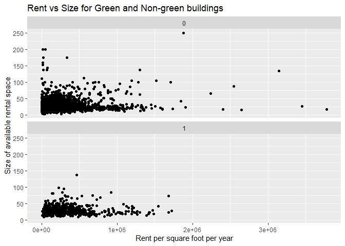<!-- -->
Not a very intuitive plot but still we can see that non green buildings are more spread both in terms of size and rent.


```r
size_groupby = greenbuildings%>%
  group_by(size, green_rating)%>%
  summarize(rent_median = median(Rent))

ggplot(data = size_groupby) + 
  geom_line(mapping = aes(x = size, y = rent_median)) +
  facet_wrap(~ green_rating, nrow = 2) + 
  ggtitle("Median Rent by Size for Green and Non-green buildings") +
  xlab("Rent per square foot per year") + 
  ylab("Size of available rental space")
```

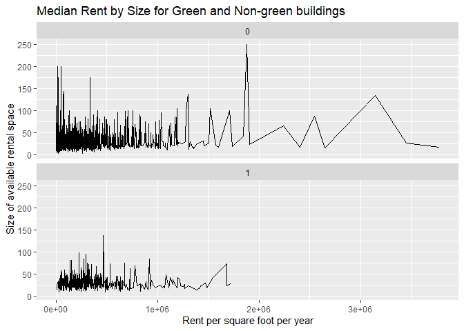<!-- -->
If we look at small sizes, there are non-green buildings with very high rent. But again hardly seems a difference if we consider size.


```r
boxplot(Rent~green_rating, data=greenbuildings)
```

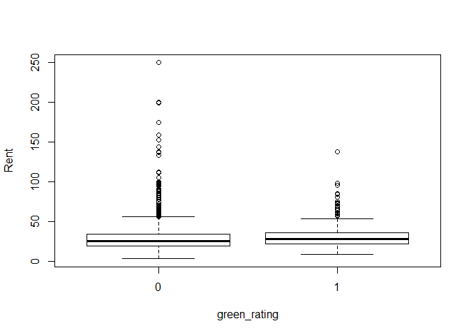<!-- -->
Non green building have more spread rent. Let's remove outliers for more balanced analysis.


```r
greenbuildings[greenbuildings$Rent>100,]
```

```
##      CS_PropertyID cluster    size empl_gr   Rent leasing_rate stories age
## 4869        251984     553   76451    2.38 144.00        97.38       3  17
## 4965        157024     559 1194037    1.15 105.12        98.93      77  77
## 4966        157144     559  562000    1.15 112.27        98.42      40  35
## 4967        157033     559 3143291    1.15 133.85        99.57      60  44
## 5008        157723     562   71350    1.15 136.67        98.74      16  76
## 5009        157373     562  336747    1.15 175.00        99.35      24  80
## 5010        158378     562   24796    1.15 175.00        91.93       8 107
## 5011        160942     562   17334    1.15 200.00        82.69       6  98
## 5052        157053     563 1518000    1.15 105.00        97.71      49  36
## 5053        157117     563 1300000    1.15 137.51       100.00      41  35
## 5054         52316     563   15726    1.15 158.92       100.00       6  67
## 5055        158124     563   51300    1.15 198.99       100.00      12  91
## 5056        157086     563 1876972    1.15 250.00        99.84      45  34
## 5091        157024     565 1194037    1.15 105.12        98.93      77  77
## 5092        157033     565 3143291    1.15 133.85        99.57      60  44
## 5149         41354     567  468787    1.15 138.07        99.25      21  79
## 5176        157024     567 1194037    1.15 105.12        98.93      77  77
## 5828        253281    1038   20520    2.38 137.04       100.00       2  35
## 5829        251984    1038   76451    2.38 144.00        97.38       3  17
## 7888        157053    1230 1518000    1.15 105.00        97.71      49  36
## 7889        664909    1230    4320    1.15 111.11         0.00       4 107
## 7890        157117    1230 1300000    1.15 137.51       100.00      41  35
## 7891        158379    1230   16140    1.15 152.73        75.22       8  90
## 7892         52316    1230   15726    1.15 158.92       100.00       6  67
## 7893        158124    1230   51300    1.15 198.99       100.00      12  91
## 7894        157086    1230 1876972    1.15 250.00        99.84      45  34
##      renovated class_a class_b LEED Energystar green_rating net amenities
## 4869         0       0       1    0          0            0   0         0
## 4965         0       1       0    0          0            0   0         1
## 4966         0       1       0    0          0            0   0         1
## 4967         0       1       0    0          0            0   0         1
## 5008         0       0       1    0          0            0   0         0
## 5009         1       0       1    0          0            0   0         1
## 5010         0       0       0    0          0            0   0         0
## 5011         0       0       0    0          0            0   0         0
## 5052         1       1       0    0          0            0   0         1
## 5053         0       1       0    0          0            0   0         0
## 5054         0       0       0    0          0            0   0         0
## 5055         0       0       1    0          0            0   0         0
## 5056         1       1       0    0          0            0   0         1
## 5091         0       1       0    0          0            0   0         1
## 5092         0       1       0    0          0            0   0         1
## 5149         0       1       0    0          1            1   0         0
## 5176         0       1       0    0          0            0   0         1
## 5828         0       0       1    0          0            0   0         0
## 5829         0       0       1    0          0            0   0         0
## 7888         1       1       0    0          0            0   0         1
## 7889         0       0       0    0          0            0   0         0
## 7890         0       1       0    0          0            0   0         0
## 7891         1       0       0    0          0            0   0         0
## 7892         0       0       0    0          0            0   0         0
## 7893         0       0       1    0          0            0   0         0
## 7894         1       1       0    0          0            0   0         1
##      cd_total_07 hd_total07 total_dd_07 Precipitation  Gas_Costs
## 4869         684       1419        2103         22.71 0.01029615
## 4965        1299       4796        6095         48.35 0.01175716
## 4966        1299       4796        6095         48.35 0.01175716
## 4967        1299       4796        6095         48.35 0.01175716
## 5008        1299       4796        6095         48.35 0.01175716
## 5009        1299       4796        6095         48.35 0.01175716
## 5010        1299       4796        6095         48.35 0.01175716
## 5011        1299       4796        6095         48.35 0.01175716
## 5052        1299       4796        6095         48.35 0.01175716
## 5053        1299       4796        6095         48.35 0.01175716
## 5054        1299       4796        6095         48.35 0.01175716
## 5055        1299       4796        6095         48.35 0.01175716
## 5056        1299       4796        6095         48.35 0.01175716
## 5091        1299       4796        6095         48.35 0.01175716
## 5092        1299       4796        6095         48.35 0.01175716
## 5149        1299       4796        6095         48.35 0.01180000
## 5176        1299       4796        6095         48.35 0.01175716
## 5828         684       1419        2103         22.71 0.01029615
## 5829         684       1419        2103         22.71 0.01029615
## 7888        1299       4796        6095         48.35 0.01175716
## 7889        1299       4796        6095         48.35 0.01175716
## 7890        1299       4796        6095         48.35 0.01175716
## 7891        1299       4796        6095         48.35 0.01175716
## 7892        1299       4796        6095         48.35 0.01175716
## 7893        1299       4796        6095         48.35 0.01175716
## 7894        1299       4796        6095         48.35 0.01175716
##      Electricity_Costs cluster_rent
## 4869        0.03780774       54.000
## 4965        0.04545721       65.940
## 4966        0.04545721       65.940
## 4967        0.04545721       65.940
## 5008        0.04545721       45.970
## 5009        0.04545721       45.970
## 5010        0.04545721       45.970
## 5011        0.04545721       45.970
## 5052        0.04545721       65.775
## 5053        0.04545721       65.775
## 5054        0.04545721       65.775
## 5055        0.04545721       65.775
## 5056        0.04545721       65.775
## 5091        0.04545721       65.915
## 5092        0.04545721       65.915
## 5149        0.04550000       65.000
## 5176        0.04545721       65.000
## 5828        0.03780774       55.690
## 5829        0.03780774       55.690
## 7888        0.04545721       58.720
## 7889        0.04545721       58.720
## 7890        0.04545721       58.720
## 7891        0.04545721       58.720
## 7892        0.04545721       58.720
## 7893        0.04545721       58.720
## 7894        0.04545721       58.720
```
There are just 26 buildings with more than $100 rent, for more balanced analysis let's drop them from our dataset.


```r
greenbuildings = greenbuildings[greenbuildings$Rent<=100,]
boxplot(Rent~green_rating, data=greenbuildings)
```

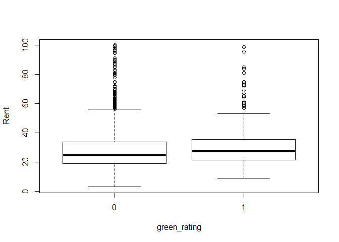<!-- -->
Now it looks evenly distributed and green buildings clearly seem to have higher median rent.


```r
class_a_groupby = greenbuildings%>%
  group_by(class_a, green_rating)%>%
  summarize(rent_median = median(Rent))

class_a_groupby
```

```
## # A tibble: 4 x 3
## # Groups:   class_a [2]
##   class_a green_rating rent_median
##     <int> <fct>              <dbl>
## 1       0 0                   23.4
## 2       0 1                   25.6
## 3       1 0                   28.2
## 4       1 1                   28.4
```

```r
ggplot(class_a_groupby, aes(x = factor(class_a), y = rent_median, fill=green_rating)) + 
  geom_bar(stat='identity', position = 'dodge') +
  ggtitle("Median Rent for Green and Non-green buildings by Class_a") +
  ylab("Median Rent per square foot per year") +
  xlab("Class_a")
```

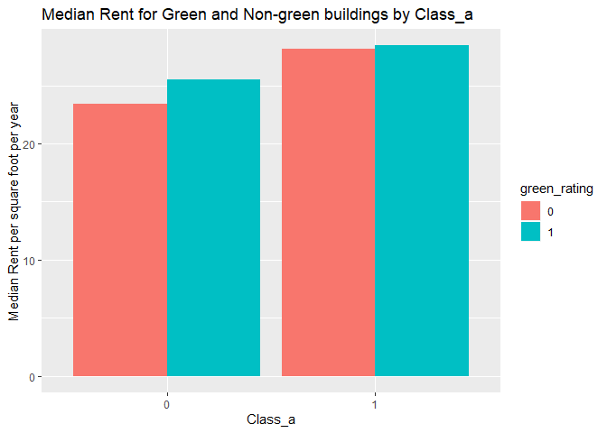<!-- -->
There is hardly a difference(just 20 cents) between the median rent of green and non-green building in class_a


```r
net_groupby = greenbuildings%>%
  group_by(net, green_rating)%>%
  summarize(rent_med = median(Rent))

ggplot(net_groupby, aes(x = factor(net), y = rent_med, fill=green_rating)) + 
  geom_bar(stat='identity', position = 'dodge') +
  ggtitle("Median Rent for Green and Non-green buildings by net contract indicator") +
  ylab("Median Rent per square foot per year") +
  xlab("Net Contract Indicator")
```

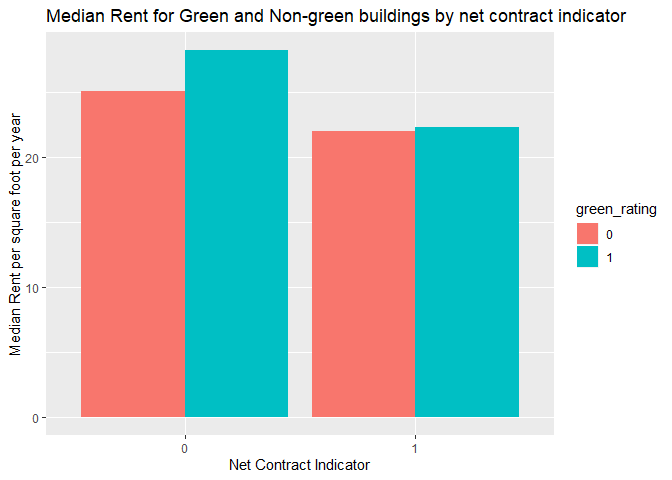<!-- -->
Tenants with net-rental contracts pay their own utility costs.Green buildings are supposed to save utility cost so for net =1, people are paying utilities separately and hence net rental cost will be high for non green buildings (assuming utility costs are significant like we have in AUstin, need utility data to prove this point). If utility cost is nominal then there is hardly any difference in rent.


```r
amenities_groupby = greenbuildings%>%
  group_by(amenities, green_rating)%>%
  summarize(rent_med = median(Rent))

amenities_groupby
```

```
## # A tibble: 4 x 3
## # Groups:   amenities [2]
##   amenities green_rating rent_med
##       <int> <fct>           <dbl>
## 1         0 0                25  
## 2         0 1                27  
## 3         1 0                25  
## 4         1 1                27.8
```

```r
ggplot(amenities_groupby, aes(x = factor(amenities), y = rent_med, fill=green_rating)) + 
  geom_bar(stat='identity', position = 'dodge') +
  ggtitle("Median Rent for Green and Non-green buildings by amenities") +
  ylab("Median Rent per square foot per year") +
  xlab("Amenities Indicator")
```

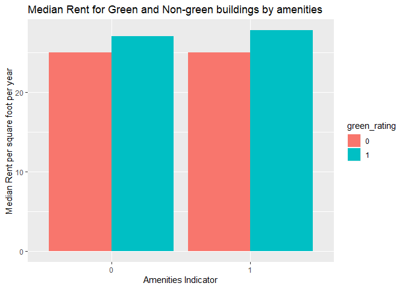<!-- -->
Clearly green buldings with amenities have a huge advantage in rent. Builder should focus on this!!!


```r
renovated_groupby = greenbuildings%>%
  group_by(renovated, green_rating)%>%
  summarize(rent_mean = mean(Rent))

renovated_groupby
```

```
## # A tibble: 4 x 3
## # Groups:   renovated [2]
##   renovated green_rating rent_mean
##       <int> <fct>            <dbl>
## 1         0 0                 29.4
## 2         0 1                 29.7
## 3         1 0                 25.5
## 4         1 1                 30.3
```

```r
ggplot(renovated_groupby, aes(x = factor(renovated), y = rent_mean, fill=green_rating)) + 
  geom_bar(stat='identity', position = 'dodge') +
  ggtitle("Mean Rent for Green and Non-green buildings by renovation") +
  ylab("Mean Rent per square foot per year") +
  xlab("Renovation Indicator")
```

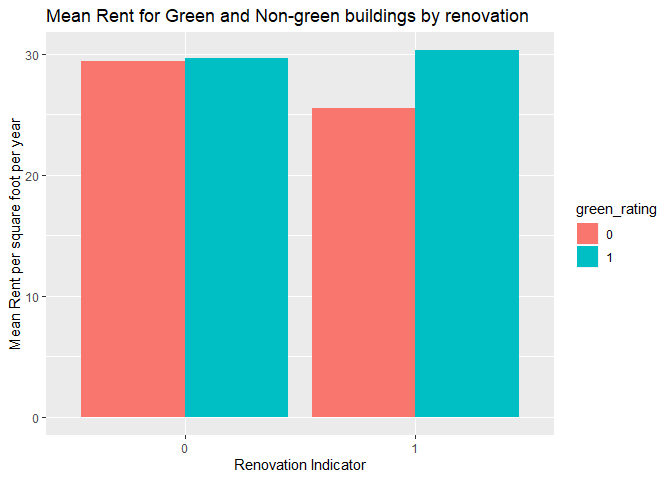<!-- -->
The mean rent for non-renovated buildings are same for both green and non-green buildings. And clearly renovated green buildings have an edge. So builder should keep renovation cost in mind too for long run success.


```r
# Looking at building stories distribution. Bucketing them will give more intuitive results
table(greenbuildings$stories)
```

```
## 
##   1   2   3   4   5   6   7   8   9  10  11  12  13  14  15  16  17  18 
## 154 680 650 597 405 429 277 273 187 369 286 526 205 183 165 202 119  97 
##  19  20  21  22  23  24  25  26  27  28  29  30  31  32  33  34  35  36 
##  68 188 130 159 112  95  97  80  72  85  31  88  42  38  27  48  47  62 
##  37  38  39  40  41  42  43  44  45  46  47  48  49  50  51  52  53  54 
##  36  48  16  52  60  38   6  26  14   2  11  35  13  34  17  33   5  17 
##  55  56  57  58  60  62  64  70  71  73  75  76  82 110 
##   4   8  11   4   5  16   2   1   1   1   1   1   1   2
```


```r
# Bucketing the buildings by stories
greenbuildings$storiesbins = cut(greenbuildings$stories,c(0,10,20,50,120))

green_groupby = greenbuildings%>%
  group_by(storiesbins, green_rating)%>%
  summarize(rent_med = median(Rent))

ggplot(green_groupby, aes(x = storiesbins, y = rent_med, fill=green_rating)) + 
  geom_bar(stat='identity', position = 'dodge') +
  ggtitle("Median Rent for Green and Non-green buildings by building stories") +
  ylab("Median Rent per square foot per year") +
  xlab("Building Stories Bins")
```

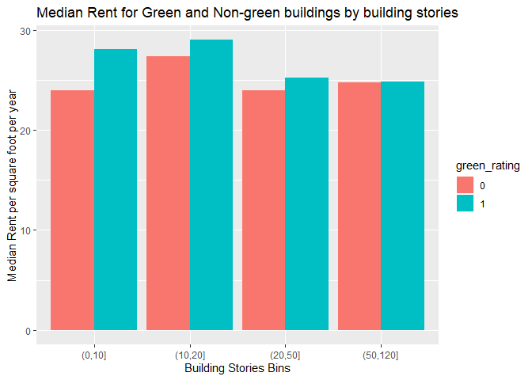<!-- -->
The builder is planning to build 15 stories building, clearly green building has an edge here


```r
greenbuildings$agebins = cut(greenbuildings$age,c(-1,20,40,75,100,200))

age_groupby = greenbuildings%>%
  group_by(agebins, green_rating)%>%
  summarize(rent_med = median(Rent))

ggplot(age_groupby, aes(x = agebins, y = rent_med, fill=green_rating)) + 
  geom_bar(stat='identity', position = 'dodge') +
  ggtitle("Median Rent for Green and Non-green buildings by building age") +
  ylab("Median Rent per square foot per year") +
  xlab("Age Bins")
```

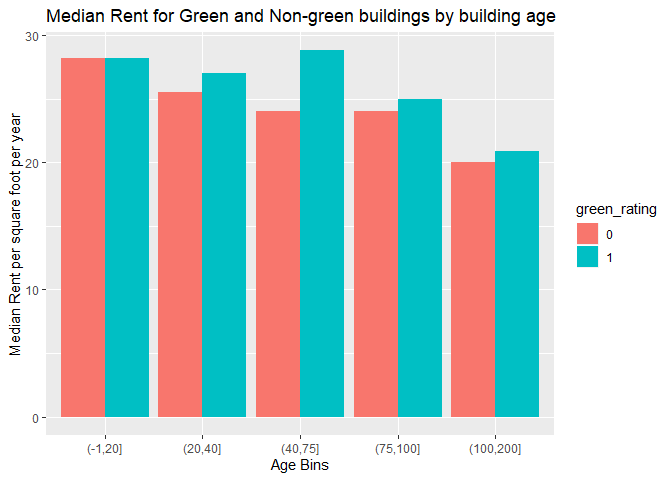<!-- -->
In first 20 years green buildings are not profitable when compared to non-green buildings. Though, in long run green building will be more profitable.


```r
ggplot(data=greenbuildings[greenbuildings$leasing_rate > 10,]) + 
  geom_boxplot(mapping=aes(group = green_rating, x=green_rating, y=leasing_rate))
```

<!-- -->
Green buildings have an edge in occupancy rate with higher median occupancy than non green buildings

# --------------------------------------------------------------------------- #
Key Inferences:
1. Excel Guru needs to revisit his analysis. There are a lot of other factors that should be considered in his calculation.
2. There is no information about which class the new building will fall in. For class_a buildings, there is hardly any difference (just 20 cents) between the median rent of green and non-green buildings. So, if the building is going to fall in this category it won't have an edge over non-green building
3. In first 20 years green buildings are not profitable when compared to non-green buildings. So, the conclusion of Excel Guru that green building will start making extra profits starting 9th year doesn't look correct 
4. Renovated green buildings might seem to have an edge over non-green buildings in a long run. But then we need to consider renovation cost and other investments in the calculation
5. We don't have information about utility cost but if utility cost is not significant then there is no advantage for green buildings where rent is quoted on a net contract basis. Builders should include utility cost in the quoted rental price to make more profit
6. We don't have enough data to conclude whether green building will certainly have an edge over non-green or not. More data around utility cost, amenities details, renovation cost etc. will help us make more informed decision.


# *******************
# Portfolio modeling
# *******************


```r
# Loading required libraries
library(mosaic)
library(quantmod)
```

```
## Loading required package: xts
```

```
## Loading required package: zoo
```

```
## 
## Attaching package: 'zoo'
```

```
## The following objects are masked from 'package:base':
## 
##     as.Date, as.Date.numeric
```

```
## Registered S3 method overwritten by 'xts':
##   method     from
##   as.zoo.xts zoo
```

```
## 
## Attaching package: 'xts'
```

```
## The following objects are masked from 'package:dplyr':
## 
##     first, last
```

```
## Loading required package: TTR
```

```
## Registered S3 method overwritten by 'quantmod':
##   method            from
##   as.zoo.data.frame zoo
```

```
## Version 0.4-0 included new data defaults. See ?getSymbols.
```

```r
library(foreach)
```

```
## 
## Attaching package: 'foreach'
```

```
## The following objects are masked from 'package:purrr':
## 
##     accumulate, when
```


```r
# We will select a diverse group of ETFs covering safe to risk categories. We will juggle around with different weights to make the portfolio safe, diverse and aggressive

# IVV - Safe - iShares Core S&P 500 ETF tracks the S&P 500
# QQQ - Safe - a tech-heavy fund with the big names
# SPY - Safe - tops the list in terms of AUM and trading volume
# SVXY - Risky - 2018 was a bad year
# IHI - Aggresive - ETF with high risk and high return potential
# IGV - Aggresive - ETF with high risk and high return potential

myetfs = c("IVV", "QQQ", "SPY", "SVXY", "IHI", "IGV")
myprices = getSymbols(myetfs, from = "2014-01-01")
```

```
## 'getSymbols' currently uses auto.assign=TRUE by default, but will
## use auto.assign=FALSE in 0.5-0. You will still be able to use
## 'loadSymbols' to automatically load data. getOption("getSymbols.env")
## and getOption("getSymbols.auto.assign") will still be checked for
## alternate defaults.
## 
## This message is shown once per session and may be disabled by setting 
## options("getSymbols.warning4.0"=FALSE). See ?getSymbols for details.
```

```
## pausing 1 second between requests for more than 5 symbols
## pausing 1 second between requests for more than 5 symbols
```


```r
# Adjusting all stocks for splits and dividends
for(ticker in myetfs) {
	expr = paste0(ticker, "a = adjustOHLC(", ticker, ")")
	eval(parse(text=expr))
}

head(IVVa)[1]
```

```
##            IVV.Open IVV.High  IVV.Low IVV.Close IVV.Volume IVV.Adjusted
## 2014-01-02 165.5003 165.5897 164.1766   164.579    6724900      164.579
```

```r
head(QQQa)[1]
```

```
##            QQQ.Open QQQ.High  QQQ.Low QQQ.Close QQQ.Volume QQQ.Adjusted
## 2014-01-02 82.62719 82.65551 82.12699  82.36293   29177500     82.36295
```

```r
head(SPYa)[1]
```

```
##            SPY.Open SPY.High SPY.Low SPY.Close SPY.Volume SPY.Adjusted
## 2014-01-02  165.089 165.1698 163.743  164.1379  119636900     164.1379
```

```r
head(SVXYa)[1]
```

```
##            SVXY.Open SVXY.High SVXY.Low SVXY.Close SVXY.Volume
## 2014-01-02     132.9    133.44   131.32     132.23      704200
##            SVXY.Adjusted
## 2014-01-02        132.23
```

```r
head(IHIa)[1]
```

```
##            IHI.Open IHI.High  IHI.Low IHI.Close IHI.Volume IHI.Adjusted
## 2014-01-02 89.56049 89.67663 88.90239  89.05723     127500     89.05721
```

```r
head(IGVa)[1]
```

```
##            IGV.Open IGV.High  IGV.Low IGV.Close IGV.Volume IGV.Adjusted
## 2014-01-02  80.2208 80.33878 79.88656  80.18148     127900      80.1815
```


```r
# Combine close to close changes in a single matrix

all_returns = cbind(	
                ClCl(IVVa),
								ClCl(QQQa),
								ClCl(SPYa),
								ClCl(SVXYa),
								ClCl(IHIa),
								ClCl(IGVa))
head(all_returns)
```

```
##                ClCl.IVVa    ClCl.QQQa     ClCl.SPYa   ClCl.SVXYa
## 2014-01-02            NA           NA            NA           NA
## 2014-01-03 -0.0004347699 -0.007218953 -0.0001640007  0.006050087
## 2014-01-06 -0.0027184256 -0.003693433 -0.0028979059  0.011952161
## 2014-01-07  0.0061604157  0.009267875  0.0061416703  0.023399265
## 2014-01-08  0.0005418617  0.002180842  0.0002180510 -0.001669529
## 2014-01-09  0.0004873605 -0.003321510  0.0006538524 -0.002617421
##              ClCl.IHIa     ClCl.IGVa
## 2014-01-02          NA            NA
## 2014-01-03 0.004564280  0.0002452673
## 2014-01-06 0.006490686 -0.0068644887
## 2014-01-07 0.010855567  0.0144409410
## 2014-01-08 0.010632642  0.0026767489
## 2014-01-09 0.002314508 -0.0043684138
```

```r
all_returns = as.matrix(na.omit(all_returns))
```


```r
# Plotting close to close changes. SVXY has a few abrupt days
par(mfrow = c(3,2))

plot(ClCl(IVVa))
plot(ClCl(QQQa))
plot(ClCl(SPYa))
plot(ClCl(SVXYa))
plot(ClCl(IHIa))
plot(ClCl(IGVa))
```

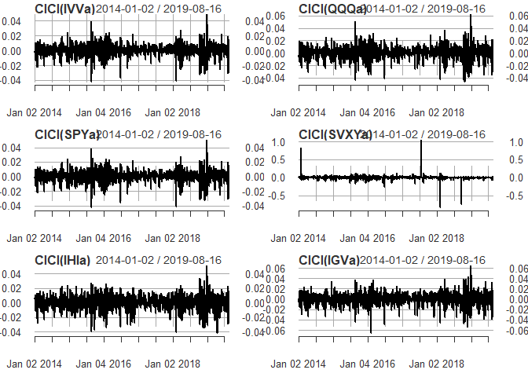<!-- -->


```r
# Look at the market returns over time
par(mfrow = c(1,1))
plot(all_returns[,3], type='l')
```

<!-- -->


```r
# ACF plots shows that there is no significant correlation beyween returns of today and any other day in past 30 days period
acf(all_returns[,3])
```

<!-- -->

# Safe Portfolio - more weightage to conventional safe stocks

```r
# Let's do our simulation
set.seed(123)
initial_wealth = 100000
sim1 = foreach(i=1:10000, .combine='rbind') %do% {
	total_wealth = initial_wealth
	weights = c(0.25, 0.25, 0.30, 0.1, 0.05, 0.05)
	holdings = weights * total_wealth
	n_days = 20
	wealthtracker_safe = rep(0, n_days)
	for(today in 1:n_days) { 
		return.today = resample(all_returns, 1, orig.ids=FALSE) # bootstrapping
		holdings = holdings + holdings*return.today # updating holdings
		total_wealth = sum(holdings) # getting updated total value of portfolio
		wealthtracker_safe[today] = total_wealth # portfolio value of the day
		holdings = weights * total_wealth # redistributing wealth everyday
	}
	wealthtracker_safe
}
```


```r
# Let's look at the distribution to understand return range
hist(sim1[,n_days], 20,
     main="Safe Portflio Holdings Distribution",
     xlab="Net Portfolio Value")
```

<!-- -->

```r
wealthtracker_safe
```

```
##  [1] 97464.50 95548.81 95267.11 94536.08 94316.44 94377.95 94441.36
##  [8] 94303.79 94326.15 94429.31 91861.72 91945.99 92028.76 92642.54
## [15] 92968.07 93114.12 93174.13 93794.36 93528.60 93085.42
```

The value at risk of our safe portfolios at the 5% level is $7,688

```r
quantile(sim1[,20] - 100000, 0.05)
```

```
##        5% 
## -7688.505
```

# Diverse Portfolio - similar weightage to all the stocks

```r
# Let's do our second simulation
set.seed(234)
initial_wealth = 100000
sim2 = foreach(i=1:10000, .combine='rbind') %do% {
	total_wealth = initial_wealth
	weights = c(0.17, 0.17, 0.21, 0.15, 0.15, 0.15)
	holdings = weights * total_wealth
	n_days = 20
	wealthtracker_diverse = rep(0, n_days)
	for(today in 1:n_days) {
		return.today = resample(all_returns, 1, orig.ids=FALSE)
		holdings = holdings + holdings*return.today
		total_wealth = sum(holdings)
		wealthtracker_diverse[today] = total_wealth
		holdings = weights * total_wealth
	}
	wealthtracker_diverse
}
```


```r
# Let's look at the distribution to understand return range
hist(sim2[,n_days], 30,
     main="Diverse Portflio Holdings Distribution",
     xlab="Net Portfolio Value")
```

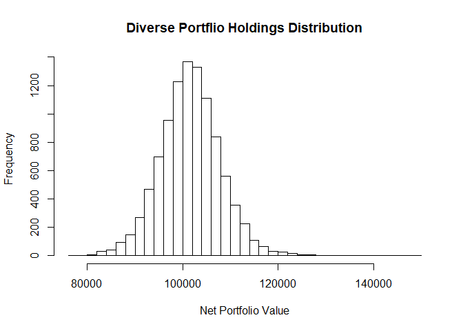<!-- -->

```r
wealthtracker_diverse
```

```
##  [1]  98424.4 101588.9 100844.2 101252.1 102247.0 101972.2 101268.7
##  [8] 100337.2 100835.0 103443.1 104790.1 106523.3 106879.2 107346.8
## [15] 107301.0 107518.2 108539.1 109077.1 109345.1 111151.9
```
The value at risk of our diverse portfolios at the 5% level is $8,622

```r
quantile(sim2[,20] - 100000, 0.05)
```

```
##        5% 
## -8622.763
```

# Aggressive Portfolio - more weightage to aggressive stocks

```r
# Let's do our simulation
set.seed(456)
initial_wealth = 100000
sim3 = foreach(i=1:10000, .combine='rbind') %do% {
	total_wealth = initial_wealth
	weights = c(0.1, 0.1, 0.1, 0.2, 0.25, 0.25)
	holdings = weights * total_wealth
	n_days = 20
	wealthtracker_agg = rep(0, n_days)
	for(today in 1:n_days) {
		return.today = resample(all_returns, 1, orig.ids=FALSE)
		holdings = holdings + holdings*return.today
		total_wealth = sum(holdings)
		wealthtracker_agg[today] = total_wealth
		holdings = weights * total_wealth
	}
	wealthtracker_agg
}
```


```r
# Let's look at the distribution to understand return range
hist(sim3[,n_days], 30,
     main="Aggressive Portflio Holdings Distribution",
     xlab="Net Portfolio  Value")
```

<!-- -->

```r
wealthtracker_agg
```

```
##  [1] 101368.4 102073.7 103073.1 103627.5 105253.0 106026.7 105689.7
##  [8] 105785.4 106755.3 102581.2 102017.8 101881.0 101450.5 100767.3
## [15] 101654.0 101051.2 100791.3 102883.6 103920.5 104666.1
```

The value at risk of our aggressive portfolios at the 5% level is $10,454

```r
quantile(sim3[,20] - 100000, 0.05)
```

```
##       5% 
## -10454.6
```

# --------------------------------------------------------------------------- #
Inference:
1. We can see that as the share of risky ETFs rises, the VaR increases.
2. A safe portfolio with 75% weightage to conventional big and safe ETFs("IVV", "QQQ", "SPY") has VaR of ~$7.7k - good long term investment
3. A diverse portfolio with good mix of safe and aggressive ETFs has VaR of ~$8.6k - a more balanced portfolio
4. An aggressive portfolio with 70% weigtage to aggressive ETFs("SVXY", "IHI", "IGV") has VaR of ~$10.5k - suits best for people with huge risk appetite and who wants to make more money


# *******************
# Author attribution
# *******************


```r
## Loading required libraries
library(tm) 
```

```
## Loading required package: NLP
```

```
## 
## Attaching package: 'NLP'
```

```
## The following object is masked from 'package:ggplot2':
## 
##     annotate
```

```
## 
## Attaching package: 'tm'
```

```
## The following object is masked from 'package:mosaic':
## 
##     inspect
```

```r
library(magrittr)
```

```
## 
## Attaching package: 'magrittr'
```

```
## The following object is masked from 'package:purrr':
## 
##     set_names
```

```
## The following object is masked from 'package:tidyr':
## 
##     extract
```

```r
library(slam)
library(proxy)
```

```
## 
## Attaching package: 'proxy'
```

```
## The following object is masked from 'package:Matrix':
## 
##     as.matrix
```

```
## The following objects are masked from 'package:stats':
## 
##     as.dist, dist
```

```
## The following object is masked from 'package:base':
## 
##     as.matrix
```

```r
library(tidyverse)
library(glmnet)
```

```
## Loaded glmnet 2.0-18
```

```r
library(randomForest)
```

```
## randomForest 4.6-14
```

```
## Type rfNews() to see new features/changes/bug fixes.
```

```
## 
## Attaching package: 'randomForest'
```

```
## The following object is masked from 'package:ggplot2':
## 
##     margin
```

```
## The following object is masked from 'package:dplyr':
## 
##     combine
```

```r
library(caret)
```

```
## 
## Attaching package: 'caret'
```

```
## The following object is masked from 'package:purrr':
## 
##     lift
```

```
## The following object is masked from 'package:mosaic':
## 
##     dotPlot
```

```r
library(e1071)
```


```r
## function to read plain text documents in English
readerPlain = function(fname){
  readPlain(elem=list(content=readLines(fname)), 
            id=fname, language='en') }
```


```r
# getting list of all the 50 train folders
train_folder_names = dir("C:/Users/manas/Desktop/STA380-master/data/ReutersC50/C50train")

train_folder_names
```

```
##  [1] "AaronPressman"     "AlanCrosby"        "AlexanderSmith"   
##  [4] "BenjaminKangLim"   "BernardHickey"     "BradDorfman"      
##  [7] "DarrenSchuettler"  "DavidLawder"       "EdnaFernandes"    
## [10] "EricAuchard"       "FumikoFujisaki"    "GrahamEarnshaw"   
## [13] "HeatherScoffield"  "JaneMacartney"     "JanLopatka"       
## [16] "JimGilchrist"      "JoeOrtiz"          "JohnMastrini"     
## [19] "JonathanBirt"      "JoWinterbottom"    "KarlPenhaul"      
## [22] "KeithWeir"         "KevinDrawbaugh"    "KevinMorrison"    
## [25] "KirstinRidley"     "KouroshKarimkhany" "LydiaZajc"        
## [28] "LynneO'Donnell"    "LynnleyBrowning"   "MarcelMichelson"  
## [31] "MarkBendeich"      "MartinWolk"        "MatthewBunce"     
## [34] "MichaelConnor"     "MureDickie"        "NickLouth"        
## [37] "PatriciaCommins"   "PeterHumphrey"     "PierreTran"       
## [40] "RobinSidel"        "RogerFillion"      "SamuelPerry"      
## [43] "SarahDavison"      "ScottHillis"       "SimonCowell"      
## [46] "TanEeLyn"          "TheresePoletti"    "TimFarrand"       
## [49] "ToddNissen"        "WilliamKazer"
```


```r
# Getting the list of all the files from all the 50 folders
# "globbing" = expanding wild cards in filename paths

file_list_train = {}
for (x in train_folder_names){
  file_list_train = c(file_list_train, Sys.glob(paste0('C:/Users/manas/Desktop/STA380-master/data/ReutersC50/C50train/', x,'/*.txt')))}

file_list_train[1:5]
```

```
## [1] "C:/Users/manas/Desktop/STA380-master/data/ReutersC50/C50train/AaronPressman/106247newsML.txt"
## [2] "C:/Users/manas/Desktop/STA380-master/data/ReutersC50/C50train/AaronPressman/120600newsML.txt"
## [3] "C:/Users/manas/Desktop/STA380-master/data/ReutersC50/C50train/AaronPressman/120683newsML.txt"
## [4] "C:/Users/manas/Desktop/STA380-master/data/ReutersC50/C50train/AaronPressman/136958newsML.txt"
## [5] "C:/Users/manas/Desktop/STA380-master/data/ReutersC50/C50train/AaronPressman/137498newsML.txt"
```


```r
# read all 50X50 files
train_files = lapply(file_list_train, readerPlain)

train_files[1]
```

```
## [[1]]
## <<PlainTextDocument>>
## Metadata:  7
## Content:  chars: 1998
```


```r
# Clean up the file names removing the directory location details
# This uses the piping operator from magrittr
mynames = file_list_train %>%
  { strsplit(., '/', fixed=TRUE) } %>%
  { lapply(., tail, n=2) } %>%
  { lapply(., paste0, collapse = '') } %>%
  unlist

names(train_files) = mynames

train_files[1]
```

```
## $AaronPressman106247newsML.txt
## <<PlainTextDocument>>
## Metadata:  7
## Content:  chars: 1998
```


```r
## create a text mining 'corpus': 
train_documents_raw = Corpus(VectorSource(train_files))
```


```r
## pre-processing/tokenization steps

## tm_map just maps some function to every document in the corpus
my_documents_train = train_documents_raw
my_documents_train = tm_map(my_documents_train, content_transformer(tolower)) # make everything lowercase
```

```
## Warning in tm_map.SimpleCorpus(my_documents_train,
## content_transformer(tolower)): transformation drops documents
```

```r
my_documents_train = tm_map(my_documents_train, content_transformer(removeNumbers)) # remove numbers
```

```
## Warning in tm_map.SimpleCorpus(my_documents_train,
## content_transformer(removeNumbers)): transformation drops documents
```

```r
my_documents_train = tm_map(my_documents_train, content_transformer(removePunctuation)) # remove punctuation
```

```
## Warning in tm_map.SimpleCorpus(my_documents_train,
## content_transformer(removePunctuation)): transformation drops documents
```

```r
my_documents_train = tm_map(my_documents_train, content_transformer(stripWhitespace)) ## remove excess white-space
```

```
## Warning in tm_map.SimpleCorpus(my_documents_train,
## content_transformer(stripWhitespace)): transformation drops documents
```

```r
## Removing stopwords
?stopwords
```

```
## starting httpd help server ... done
```

```r
my_documents_train = tm_map(my_documents_train, content_transformer(removeWords), stopwords("en"))
```

```
## Warning in tm_map.SimpleCorpus(my_documents_train,
## content_transformer(removeWords), : transformation drops documents
```


```r
## create a doc-term-matrix
DTM_train = DocumentTermMatrix(my_documents_train)
DTM_train
```

```
## <<DocumentTermMatrix (documents: 2500, terms: 32570)>>
## Non-/sparse entries: 537861/80887139
## Sparsity           : 99%
## Maximal term length: 71
## Weighting          : term frequency (tf)
```


```r
## Drop those terms that only occur in one or two documents
## This is a common step: the noise of the "long tail" (rare terms)
##	can be huge, and there is nothing to learn if a term occured once.
## Below removes those terms that have count 0 in >95% of docs.
DTM_train = removeSparseTerms(DTM_train, 0.95)
DTM_train
```

```
## <<DocumentTermMatrix (documents: 2500, terms: 801)>>
## Non-/sparse entries: 280686/1721814
## Sparsity           : 86%
## Maximal term length: 18
## Weighting          : term frequency (tf)
```


```r
# construct TF IDF weights
tfidf_train = weightTfIdf(DTM_train)
X_train = as.matrix(tfidf_train)
```


```r
# y values - the names of folders are the names of the authors
y_train = file_list_train %>%
	{ strsplit(., '/', fixed=TRUE) } %>%
	{ lapply(., tail, n=2) } %>%
  { lapply(., head, n=1) } %>%
	{ lapply(., paste0, collapse = '') } %>%
	unlist

y_train[1:5]
```

```
## [1] "AaronPressman" "AaronPressman" "AaronPressman" "AaronPressman"
## [5] "AaronPressman"
```


```r
# We have too many features. Let's try using PCA for dimensionality reduction

scrub_cols = which(colSums(X_train) == 0)
X_train = X_train[,-scrub_cols]

pca_x_train = prcomp(X_train, scale=TRUE)
pca_train = summary(pca_x_train)$importance[3,]
plot(pca_train, xlab="Dimension")
```

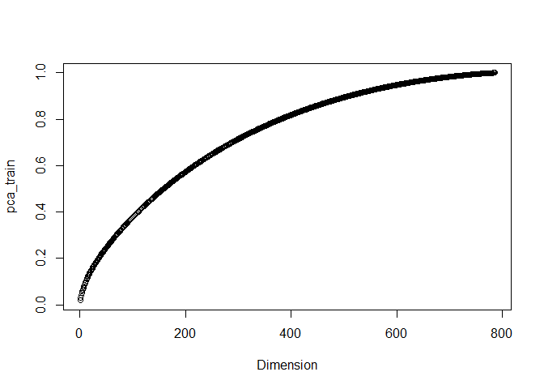<!-- -->

```r
# From the graph we can see that ~80% of variablitity is explained by just half (400/800) of the predictors.
```


```r
# repeating all the above data processing steps for test data

test_folder_names = dir("C:/Users/manas/Desktop/STA380-master/data/ReutersC50/C50test")

file_list_test = {}
for (x in test_folder_names){
  file_list_test = c(file_list_test, Sys.glob(paste0('C:/Users/manas/Desktop/STA380-master/data/ReutersC50/C50test/', x,'/*.txt')))}

test_files = lapply(file_list_test, readerPlain)

mynames_test = file_list_test %>%
  { strsplit(., '/', fixed=TRUE) } %>%
  { lapply(., tail, n=2) } %>%
  { lapply(., paste0, collapse = '') } %>%
  unlist

names(test_files) = mynames_test

test_documents_raw = Corpus(VectorSource(test_files))

## Some pre-processing/tokenization steps.
## tm_map just maps some function to every document in the corpus
my_documents_test = test_documents_raw
my_documents_test = tm_map(my_documents_test, content_transformer(tolower)) # make everything lowercase
```

```
## Warning in tm_map.SimpleCorpus(my_documents_test,
## content_transformer(tolower)): transformation drops documents
```

```r
my_documents_test = tm_map(my_documents_test, content_transformer(removeNumbers)) # remove numbers
```

```
## Warning in tm_map.SimpleCorpus(my_documents_test,
## content_transformer(removeNumbers)): transformation drops documents
```

```r
my_documents_test = tm_map(my_documents_test, content_transformer(removePunctuation)) # remove punctuation
```

```
## Warning in tm_map.SimpleCorpus(my_documents_test,
## content_transformer(removePunctuation)): transformation drops documents
```

```r
my_documents_test = tm_map(my_documents_test, content_transformer(stripWhitespace)) ## remove excess white-space
```

```
## Warning in tm_map.SimpleCorpus(my_documents_test,
## content_transformer(stripWhitespace)): transformation drops documents
```

```r
## Remove stopwords.  Always be careful with this: one person's trash is another one's treasure.
?stopwords
my_documents_test = tm_map(my_documents_test, content_transformer(removeWords), stopwords("en"))
```

```
## Warning in tm_map.SimpleCorpus(my_documents_test,
## content_transformer(removeWords), : transformation drops documents
```

```r
# Ignoring words in test document matrix which are not in train document
DTM_test = DocumentTermMatrix(my_documents_test, control = list(dictionary=Terms(DTM_train)))

# TF-IDF
tfidf_test = weightTfIdf(DTM_test)
X_test = as.matrix(tfidf_test)

# Target variable for test set - basically the name of authors(folder name)
y_test = file_list_test %>%
	{ strsplit(., '/', fixed=TRUE) } %>%
	{ lapply(., tail, n=2) } %>%
  { lapply(., head, n=1) } %>%
	{ lapply(., paste0, collapse = '') } %>%
	unlist

scrub_cols_test = which(colSums(X_test) == 0)
X_test = X_test[,-scrub_cols_test]

# to make sure that we select same PCA result features for test set as well
new_x_test = predict(pca_x_train,newdata =X_test)[,1:400]
```

Our train data, target variable and test sets are ready, Let's try Random Forest and Naive Baye algorithms to predict author of any given article.


```r
# Naive Bayes

nb_model =naiveBayes(as.factor(y_train) ~., data=as.data.frame(pca_x_train$x[,1:400]))

nb_pred = predict(nb_model,new_x_test)

nb_conf_matx <- caret::confusionMatrix(nb_pred,as.factor(y_test))
accuracy_nb <- nb_conf_matx$overall['Accuracy']
accuracy_nb
```

```
## Accuracy 
##   0.4604
```

```r
# 46.04% accuracy
```


```r
# Random Forest 

rf_model = randomForest(as.factor(y_train) ~ ., data=as.data.frame(pca_x_train$x[,1:400]), ntree=1000, mtry=20, importance=TRUE)

rf_pred = predict(rf_model,new_x_test)

confusion_matrix <- caret::confusionMatrix(rf_pred,as.factor(y_test))
accuracy <- confusion_matrix$overall['Accuracy']
accuracy
```

```
## Accuracy 
##   0.5072
```

```r
#50.72% accurate predictions. Random Forest with 250 trees gave an accuracy of 46.52%
```


# *******************
# Market segmentation
# *******************


```r
mktg = read.csv('C:/Users/manas/Downloads/social_marketing.csv',header=TRUE)

#Removing the user id and spam columns
mktg=mktg %>% select(-'chatter', -'uncategorized', -'spam', -'adult', -'X')

#Scaling the dataset
mktg_scaled = scale(mktg, center=TRUE, scale=TRUE)
mu = attr(mktg_scaled,"scaled:center")
sigma = attr(mktg_scaled,"scaled:scale")
```


```r
#Categories with maximum number of tweets
sort(colSums(mktg), decreasing = TRUE)[1:10]
```

```
##    photo_sharing health_nutrition          cooking         politics 
##            21256            20235            15750            14098 
##    sports_fandom           travel      college_uni   current_events 
##            12564            12493            12213            12030 
## personal_fitness             food 
##            11524            11015
```

```r
#photo_sharing, health_nutrition and cooking were the categories with most tweets
```


```r
#Correlation plot between the categories
library(corrplot)
```

```
## corrplot 0.84 loaded
```

```r
corr_matrix <- cor(mktg)
corrplot(corr_matrix,method = 'shade',type = 'upper')
```

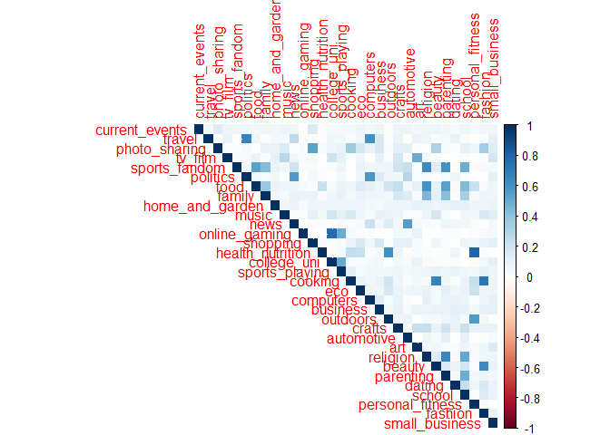<!-- -->

```r
#The following pairts had the highest correlation:
#college_uni and online_gaming
#health_nutrition and personal_fitness
#travel and politics
```


```r
#k-means clustering
clust1 = kmeans(mktg_scaled, 6, nstart=25)

for (i in c(1:6)){
  a=which(clust1$cluster==i)
  cc=mktg[a,]
  print(names(which.max(colSums(cc[,2:ncol(cc)]))))
}
```

```
## [1] "sports_fandom"
## [1] "college_uni"
## [1] "cooking"
## [1] "politics"
## [1] "health_nutrition"
## [1] "photo_sharing"
```


```r
#Euclidian distance matrix
mktg_distance_matrix = dist(mktg_scaled, method='euclidean')
hier_mktg = hclust(mktg_distance_matrix, method='average')

#Cutting the clustering tree at k=6
cluster1 = cutree(hier_mktg, k=6)
#plot(hier_mktg, cex=0.8)

for (i in c(1:6)){
  a=which(cluster1==i)
  cc=mktg[a,]
  print(names(which.max(colSums(cc[,2:ncol(cc)]))))
}
```

```
## [1] "photo_sharing"
## [1] "cooking"
## [1] "cooking"
## [1] "politics"
## [1] "art"
## [1] "politics"
```


```r
# Single linkage clustering
hier_mktg2 = hclust(mktg_distance_matrix, method='single')
cluster2 = cutree(hier_mktg2, k=6)
#plot(hier_mktg2, cex=0.8)

for (i in c(1:6)){
  a=which(cluster2==i)
  cc=mktg[a,]
  print(names(which.max(colSums(cc[,2:ncol(cc)]))))
}
```

```
## [1] "photo_sharing"
## [1] "politics"
## [1] "cooking"
## [1] "online_gaming"
## [1] "politics"
## [1] "cooking"
```


```r
# Single linkage clustering
hier_mktg3 = hclust(mktg_distance_matrix, method='complete')
cluster3 = cutree(hier_mktg3, k=6)
#plot(hier_mktg2, cex=0.8)

for (i in c(1:6)){
  a=which(cluster3==i)
  cc=mktg[a,]
  print(names(which.max(colSums(cc[,2:ncol(cc)]))))
}
```

```
## [1] "photo_sharing"
## [1] "art"
## [1] "sports_fandom"
## [1] "cooking"
## [1] "politics"
## [1] "politics"
```


```r
#k-means is able to give us more distinct clusters than any other method
#Plotting the output of k-means clustering
library(factoextra)
```

```
## Welcome! Related Books: `Practical Guide To Cluster Analysis in R` at https://goo.gl/13EFCZ
```

```r
fviz_cluster(clust1, data = mktg_scaled)
```

<!-- -->


```r
#Extracting all the cluster centers
c1 = clust1$center[1,]*sigma + mu
c2 = clust1$center[2,]*sigma + mu
c3 = clust1$center[3,]*sigma + mu
c4 = clust1$center[4,]*sigma + mu
c5 = clust1$center[5,]*sigma + mu
c6 = clust1$center[6,]*sigma + mu

cluster_centers = rbind(c1,c2,c3,c4,c5,c6)
cluster_centers = t(cluster_centers)
cluster_centers
```

```
##                         c1         c2         c3        c4         c5
## current_events   1.6802097  1.5298013  1.7591623 1.6622999  1.5519187
## travel           1.3446920  1.5452539  1.4938918 5.6084425  1.2381490
## photo_sharing    2.6304063  2.8697572  6.1169284 2.5429403  2.6896163
## tv_film          1.0498034  1.9403974  1.0226876 1.2110626  0.9887133
## sports_fandom    5.8951507  1.3421634  1.1326353 2.0101892  1.1659142
## politics         1.1677588  1.2737307  1.4048866 8.9330422  1.2550790
## food             4.5661861  1.2693157  1.0453752 1.4425036  2.1331828
## family           2.4980341  1.0551876  0.9109948 0.9126638  0.7787810
## home_and_garden  0.6461337  0.6158940  0.6212914 0.6128093  0.6467269
## music            0.7313237  1.1368653  1.2146597 0.6390102  0.7347630
## news             1.0340760  0.7902870  1.0506108 5.2940320  1.1038375
## online_gaming    1.0117955  9.2516556  1.0471204 0.8558952  0.8510158
## shopping         1.4823067  1.4017660  2.0209424 1.3857351  1.4683973
## health_nutrition 1.8505898  1.7262693  2.2844677 1.6652111 12.0067720
## college_uni      1.2005242 10.3554084  1.4607330 1.3318777  0.9480813
## sports_playing   0.7391874  2.5673289  0.8080279 0.6273654  0.6151242
## cooking          1.6159895  1.4746137 10.9057592 1.2605531  3.2663657
## eco              0.6605505  0.4856512  0.5776614 0.5997089  0.9209932
## computers        0.7313237  0.5717439  0.7277487 2.4745269  0.5575621
## business         0.5032765  0.4503311  0.6125654 0.6710335  0.4683973
## outdoors         0.6815203  0.6710817  0.8132635 0.9184862  2.7415350
## crafts           1.0825688  0.5960265  0.6352531 0.6433770  0.5936795
## automotive       1.0498034  0.8896247  0.9057592 2.3362445  0.6625282
## art              0.8754915  1.1876380  0.9057592 0.7510917  0.7449210
## religion         5.2555701  0.8476821  0.8446771 1.0291121  0.7607223
## beauty           1.1009174  0.4547461  3.8935428 0.4759825  0.4243792
## parenting        4.0589777  0.6732892  0.8062827 0.9432314  0.7652370
## dating           0.7942333  0.7373068  0.9441536 1.0655022  1.0349887
## school           2.7090433  0.5253863  0.9842932 0.7248908  0.5959368
## personal_fitness 1.1887287  0.9955850  1.3560209 1.0072780  6.4537246
## fashion          1.0275229  0.8962472  5.5305410 0.6768559  0.7945824
## small_business   0.4010485  0.4944812  0.4851658 0.4861718  0.2945824
##                         c6
## current_events   1.4446903
## travel           1.0975664
## photo_sharing    2.2818584
## tv_film          0.9871681
## sports_fandom    0.9723451
## politics         1.0123894
## food             0.7690265
## family           0.5721239
## home_and_garden  0.4384956
## music            0.5519912
## news             0.6942478
## online_gaming    0.5803097
## shopping         1.2774336
## health_nutrition 1.0951327
## college_uni      0.8880531
## sports_playing   0.4141593
## cooking          0.8495575
## eco              0.3882743
## computers        0.3734513
## business         0.3365044
## outdoors         0.4024336
## crafts           0.3623894
## automotive       0.5809735
## art              0.6221239
## religion         0.5254425
## beauty           0.3491150
## parenting        0.4584071
## dating           0.5471239
## school           0.4769912
## personal_fitness 0.6590708
## fashion          0.5148230
## small_business   0.2761062
```


#--------------------------------------------------------------------------#
#Conclusion
The k-means clustering gave us some interesting info about the followers:

Cluster 1: People who were sharing a lot of photos and discussing about current events. These can be meme creators

Cluster 2: Discussions were mainly around parenting and food. These can be doctors who post about ideal food and parenting care for babies

Cluster 3: This cluster had people who shared photos about cooking and beauty. These can be homemakers who provide homemade beauty and cooking tips

Cluster 4: A lot of posts were concentrated on health and fitness. These can be the health freaks and gym trainers

Cluster 5: This cluster had discussions about travel, news, politics and computers. These can be the bloggers and news reporters

Cluster 6: The last cluster had university and online gaming related discussions. These are the teenage gamers


# ************************
# Association rule mining
# ************************


```r
library(tidyverse)
library(arules)  # has a big ecosystem of packages built around it
```

```
## 
## Attaching package: 'arules'
```

```
## The following object is masked from 'package:tm':
## 
##     inspect
```

```
## The following objects are masked from 'package:mosaic':
## 
##     inspect, lhs, rhs
```

```
## The following object is masked from 'package:dplyr':
## 
##     recode
```

```
## The following objects are masked from 'package:base':
## 
##     abbreviate, write
```

```r
library(arulesViz)
```

```
## Loading required package: grid
```

```
## Registered S3 methods overwritten by 'registry':
##   method               from 
##   print.registry_field proxy
##   print.registry_entry proxy
```

```
## Registered S3 method overwritten by 'seriation':
##   method         from 
##   reorder.hclust gclus
```

```r
groceries <- read.transactions('C:/Users/manas/Downloads/groceries.csv', sep=',')
summary(groceries)
```

```
## transactions as itemMatrix in sparse format with
##  9835 rows (elements/itemsets/transactions) and
##  169 columns (items) and a density of 0.02609146 
## 
## most frequent items:
##       whole milk other vegetables       rolls/buns             soda 
##             2513             1903             1809             1715 
##           yogurt          (Other) 
##             1372            34055 
## 
## element (itemset/transaction) length distribution:
## sizes
##    1    2    3    4    5    6    7    8    9   10   11   12   13   14   15 
## 2159 1643 1299 1005  855  645  545  438  350  246  182  117   78   77   55 
##   16   17   18   19   20   21   22   23   24   26   27   28   29   32 
##   46   29   14   14    9   11    4    6    1    1    1    1    3    1 
## 
##    Min. 1st Qu.  Median    Mean 3rd Qu.    Max. 
##   1.000   2.000   3.000   4.409   6.000  32.000 
## 
## includes extended item information - examples:
##             labels
## 1 abrasive cleaner
## 2 artif. sweetener
## 3   baby cosmetics
```


```r
# Now run the 'apriori' algorithm
# Look at rules with support > .003 & confidence >.1 & length >= 2
grocery_rules <- apriori(groceries, parameter = list(support = 0.003, confidence = 0.1, minlen = 2))
```

```
## Apriori
## 
## Parameter specification:
##  confidence minval smax arem  aval originalSupport maxtime support minlen
##         0.1    0.1    1 none FALSE            TRUE       5   0.003      2
##  maxlen target   ext
##      10  rules FALSE
## 
## Algorithmic control:
##  filter tree heap memopt load sort verbose
##     0.1 TRUE TRUE  FALSE TRUE    2    TRUE
## 
## Absolute minimum support count: 29 
## 
## set item appearances ...[0 item(s)] done [0.00s].
## set transactions ...[169 item(s), 9835 transaction(s)] done [0.00s].
## sorting and recoding items ... [136 item(s)] done [0.00s].
## creating transaction tree ... done [0.00s].
## checking subsets of size 1 2 3 4 5 done [0.00s].
## writing ... [3922 rule(s)] done [0.00s].
## creating S4 object  ... done [0.00s].
```


```r
summary(grocery_rules)
```

```
## set of 3922 rules
## 
## rule length distribution (lhs + rhs):sizes
##    2    3    4    5 
## 1148 2372  392   10 
## 
##    Min. 1st Qu.  Median    Mean 3rd Qu.    Max. 
##   2.000   2.000   3.000   2.812   3.000   5.000 
## 
## summary of quality measures:
##     support           confidence          lift             count       
##  Min.   :0.003050   Min.   :0.1000   Min.   : 0.4457   Min.   : 30.00  
##  1st Qu.:0.003559   1st Qu.:0.1521   1st Qu.: 1.6035   1st Qu.: 35.00  
##  Median :0.004474   Median :0.2260   Median : 2.0156   Median : 44.00  
##  Mean   :0.006179   Mean   :0.2723   Mean   : 2.1167   Mean   : 60.77  
##  3rd Qu.:0.006482   3rd Qu.:0.3649   3rd Qu.: 2.4979   3rd Qu.: 63.75  
##  Max.   :0.074835   Max.   :0.8857   Max.   :11.4214   Max.   :736.00  
## 
## mining info:
##       data ntransactions support confidence
##  groceries          9835   0.003        0.1
```


```r
#Checking the association output
inspect(sort(grocery_rules, by = 'lift')[1:10])
```

```
##      lhs                        rhs                    support confidence      lift count
## [1]  {Instant food products} => {hamburger meat}   0.003050330  0.3797468 11.421438    30
## [2]  {flour}                 => {sugar}            0.004982206  0.2865497  8.463112    49
## [3]  {sugar}                 => {flour}            0.004982206  0.1471471  8.463112    49
## [4]  {processed cheese}      => {ham}              0.003050330  0.1840491  7.070792    30
## [5]  {ham}                   => {processed cheese} 0.003050330  0.1171875  7.070792    30
## [6]  {processed cheese}      => {white bread}      0.004168785  0.2515337  5.975445    41
## [7]  {citrus fruit,                                                                      
##       other vegetables,                                                                  
##       tropical fruit,                                                                    
##       whole milk}            => {root vegetables}  0.003152008  0.6326531  5.804238    31
## [8]  {baking powder}         => {sugar}            0.003253686  0.1839080  5.431639    32
## [9]  {other vegetables,                                                                  
##       root vegetables,                                                                   
##       tropical fruit,                                                                    
##       whole milk}            => {citrus fruit}     0.003152008  0.4492754  5.428284    31
## [10] {liquor}                => {bottled beer}     0.004677173  0.4220183  5.240594    46
```


```r
#Plot of the top 30 rules from overall grocery dataset
plot(head(grocery_rules, 30, by='lift'), method='graph')
```

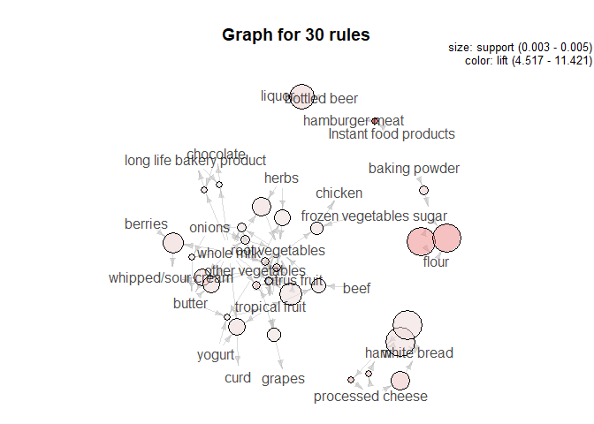<!-- -->


```r
#Plot of the vegetable association rule
root_vegetables_rules <- subset(grocery_rules, items %in% 'root vegetables')
inspect(sort(root_vegetables_rules, by = 'lift')[1:10])
```

```
##      lhs                   rhs                    support confidence     lift count
## [1]  {citrus fruit,                                                                
##       other vegetables,                                                            
##       tropical fruit,                                                              
##       whole milk}       => {root vegetables}  0.003152008  0.6326531 5.804238    31
## [2]  {other vegetables,                                                            
##       root vegetables,                                                             
##       tropical fruit,                                                              
##       whole milk}       => {citrus fruit}     0.003152008  0.4492754 5.428284    31
## [3]  {citrus fruit,                                                                
##       other vegetables,                                                            
##       root vegetables,                                                             
##       whole milk}       => {tropical fruit}   0.003152008  0.5438596 5.183004    31
## [4]  {herbs,                                                                       
##       whole milk}       => {root vegetables}  0.004168785  0.5394737 4.949369    41
## [5]  {herbs,                                                                       
##       other vegetables} => {root vegetables}  0.003863752  0.5000000 4.587220    38
## [6]  {citrus fruit,                                                                
##       root vegetables,                                                             
##       tropical fruit,                                                              
##       whole milk}       => {other vegetables} 0.003152008  0.8857143 4.577509    31
## [7]  {citrus fruit,                                                                
##       other vegetables,                                                            
##       tropical fruit}   => {root vegetables}  0.004473818  0.4943820 4.535678    44
## [8]  {beef,                                                                        
##       tropical fruit}   => {root vegetables}  0.003762074  0.4933333 4.526057    37
## [9]  {other vegetables,                                                            
##       root vegetables,                                                             
##       whole milk}       => {onions}           0.003253686  0.1403509 4.525741    32
## [10] {onions,                                                                      
##       other vegetables,                                                            
##       whole milk}       => {root vegetables}  0.003253686  0.4923077 4.516648    32
```

```r
plot(head(root_vegetables_rules, 5, by='lift'), method='graph')
```

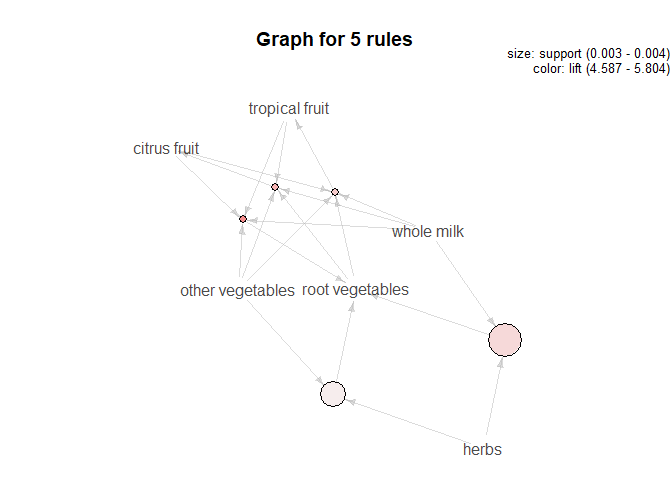<!-- -->


```r
#Plot of the cream association rule
cream_rules <- subset(grocery_rules, items %in% 'whipped/sour cream')
inspect(sort(cream_rules, by = 'lift')[1:10])
```

```
##      lhs                     rhs                      support confidence     lift count
## [1]  {berries,                                                                         
##       whole milk}         => {whipped/sour cream} 0.004270463  0.3620690 5.050990    42
## [2]  {other vegetables,                                                                
##       whipped/sour cream,                                                              
##       whole milk}         => {butter}             0.003965430  0.2708333 4.887424    39
## [3]  {butter,                                                                          
##       other vegetables,                                                                
##       whole milk}         => {whipped/sour cream} 0.003965430  0.3451327 4.814724    39
## [4]  {butter,                                                                          
##       tropical fruit}     => {whipped/sour cream} 0.003050330  0.3061224 4.270517    30
## [5]  {whipped/sour cream,                                                              
##       yogurt}             => {curd}               0.004575496  0.2205882 4.140239    45
## [6]  {whipped/sour cream,                                                              
##       yogurt}             => {cream cheese}       0.003355363  0.1617647 4.079374    33
## [7]  {butter,                                                                          
##       other vegetables}   => {whipped/sour cream} 0.005795628  0.2893401 4.036397    57
## [8]  {domestic eggs,                                                                   
##       other vegetables,                                                                
##       whole milk}         => {whipped/sour cream} 0.003558719  0.2892562 4.035227    35
## [9]  {other vegetables,                                                                
##       tropical fruit,                                                                  
##       yogurt}             => {whipped/sour cream} 0.003558719  0.2892562 4.035227    35
## [10] {tropical fruit,                                                                  
##       whole milk,                                                                      
##       yogurt}             => {whipped/sour cream} 0.004372140  0.2885906 4.025941    43
```

```r
plot(head(cream_rules, 5, by='lift'), method='graph')
```

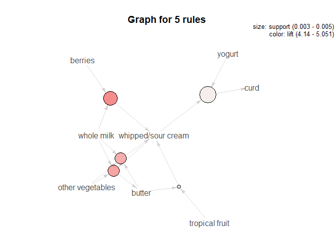<!-- -->


```r
#Plot of the yogurt association rule
yogurt_rules <- subset(grocery_rules, items %in% 'yogurt')
inspect(sort(yogurt_rules, by = 'lift')[1:10])
```

```
##      lhs                     rhs                      support confidence     lift count
## [1]  {tropical fruit,                                                                  
##       whole milk,                                                                      
##       yogurt}             => {curd}               0.003965430  0.2617450 4.912713    39
## [2]  {butter,                                                                          
##       other vegetables,                                                                
##       yogurt}             => {tropical fruit}     0.003050330  0.4761905 4.538114    30
## [3]  {other vegetables,                                                                
##       tropical fruit,                                                                  
##       yogurt}             => {butter}             0.003050330  0.2479339 4.474183    30
## [4]  {curd,                                                                            
##       tropical fruit,                                                                  
##       whole milk}         => {yogurt}             0.003965430  0.6093750 4.368224    39
## [5]  {other vegetables,                                                                
##       root vegetables,                                                                 
##       whole milk,                                                                      
##       yogurt}             => {tropical fruit}     0.003558719  0.4545455 4.331836    35
## [6]  {other vegetables,                                                                
##       tropical fruit,                                                                  
##       whole milk,                                                                      
##       yogurt}             => {root vegetables}    0.003558719  0.4666667 4.281405    35
## [7]  {other vegetables,                                                                
##       pip fruit,                                                                       
##       yogurt}             => {tropical fruit}     0.003558719  0.4375000 4.169392    35
## [8]  {whipped/sour cream,                                                              
##       yogurt}             => {curd}               0.004575496  0.2205882 4.140239    45
## [9]  {whipped/sour cream,                                                              
##       yogurt}             => {cream cheese}       0.003355363  0.1617647 4.079374    33
## [10] {other vegetables,                                                                
##       tropical fruit,                                                                  
##       yogurt}             => {whipped/sour cream} 0.003558719  0.2892562 4.035227    35
```

```r
plot(head(yogurt_rules, 5, by='lift'), method='graph')
```

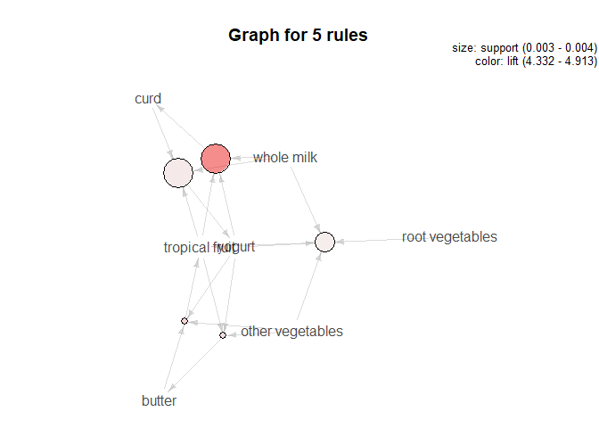<!-- -->


```r
#Plot of the yam association rule
ham_rules <- subset(grocery_rules, items %in% 'ham')
inspect(sort(ham_rules, by = 'lift')[1:10])
```

```
##      lhs                       rhs                  support     confidence
## [1]  {processed cheese}     => {ham}                0.003050330 0.1840491 
## [2]  {ham}                  => {processed cheese}   0.003050330 0.1171875 
## [3]  {ham}                  => {white bread}        0.005083884 0.1953125 
## [4]  {white bread}          => {ham}                0.005083884 0.1207729 
## [5]  {ham}                  => {domestic eggs}      0.004168785 0.1601562 
## [6]  {ham,whole milk}       => {yogurt}             0.003965430 0.3451327 
## [7]  {ham,other vegetables} => {yogurt}             0.003050330 0.3333333 
## [8]  {ham,yogurt}           => {other vegetables}   0.003050330 0.4545455 
## [9]  {ham,yogurt}           => {whole milk}         0.003965430 0.5909091 
## [10] {ham}                  => {whipped/sour cream} 0.004168785 0.1601562 
##      lift     count
## [1]  7.070792 30   
## [2]  7.070792 30   
## [3]  4.639851 50   
## [4]  4.639851 50   
## [5]  2.524258 41   
## [6]  2.474038 39   
## [7]  2.389456 30   
## [8]  2.349162 30   
## [9]  2.312611 39   
## [10] 2.234236 41
```

```r
plot(head(ham_rules, 5, by='lift'), method='graph')
```

<!-- -->


```r
#Plot of the napkin association rule
napkins_rules <- subset(grocery_rules, items %in% 'napkins')
inspect(sort(napkins_rules, by = 'lift')[1:10])
```

```
##      lhs                           rhs                  support    
## [1]  {hygiene articles}         => {napkins}            0.006100661
## [2]  {napkins}                  => {hygiene articles}   0.006100661
## [3]  {napkins,other vegetables} => {whipped/sour cream} 0.003355363
## [4]  {cat food}                 => {napkins}            0.003558719
## [5]  {napkins,other vegetables} => {root vegetables}    0.004575496
## [6]  {napkins,whole milk}       => {butter}             0.003152008
## [7]  {napkins,whole milk}       => {whipped/sour cream} 0.003965430
## [8]  {soda,tropical fruit}      => {napkins}            0.003050330
## [9]  {shopping bags,whole milk} => {napkins}            0.003558719
## [10] {napkins,whole milk}       => {domestic eggs}      0.003355363
##      confidence lift     count
## [1]  0.1851852  3.536498 60   
## [2]  0.1165049  3.536498 60   
## [3]  0.2323944  3.241984 33   
## [4]  0.1528384  2.918769 35   
## [5]  0.3169014  2.907393 45   
## [6]  0.1597938  2.883619 31   
## [7]  0.2010309  2.804453 39   
## [8]  0.1463415  2.794696 30   
## [9]  0.1452282  2.773436 35   
## [10] 0.1701031  2.681032 33
```

```r
plot(head(napkins_rules, 5, by='lift'), method='graph')
```

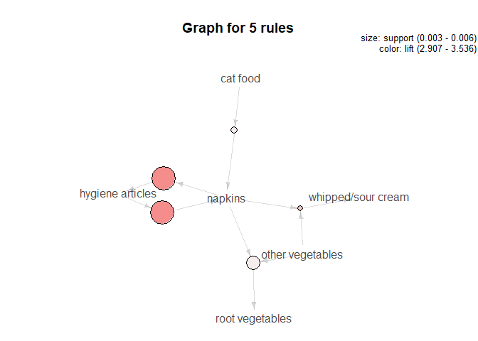<!-- -->

#-----------------------------------------------------------------------------#
#Conclusion

The probability of a person buying ham is high when he/she buys either white bread or processed cheese. That's the perfect combination for a yummy sandwich!

Napkins and hygiene articles are usually bought together

All fruits and vegetables formed a good association with a high lift value of 5.8

Berries, whipped cream and butter are bought together. These are the people who are interested in baking

The dairy products: whole milk, yogurt and curd were also bought together often
